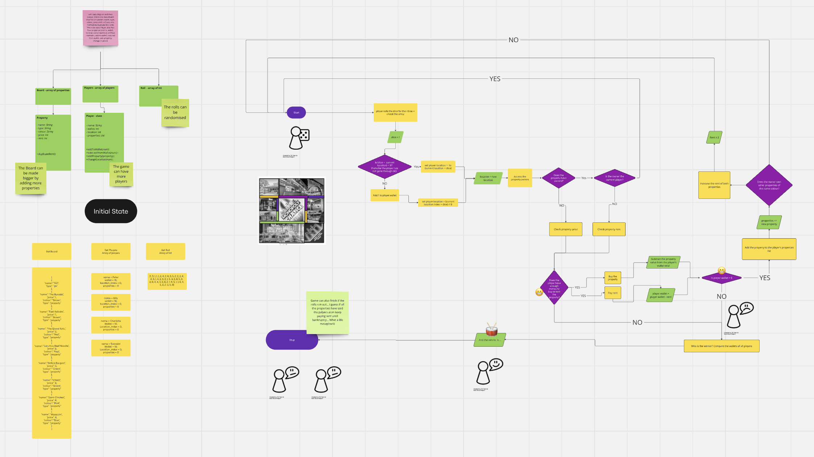

## 🏠 Woven Monopoly Game - Python

A simplified Monopoly-style game implemented in Python. Players roll dice, move around a virtual board, buy properties, pay rent, and aim to dominate the market! 🎲💰

### 📜 Features
- 🎲 Dice rolling with randomized movement
- 🏡 Buy and own properties
- 💸 Pay rent when landing on owned properties
- 👥 Multiplayer support
- 🔄 Dynamic game logic with win conditions

### 🚀 Installation
1. **Clone the repository**:

   ```sh
   git clone https://github.com/avpizarro/woven_monopoly.git
   cd woven_monopoly
   
2. **Create a virtual environment (recommended)**:

    ```sh
    python3 -m venv venv
    source venv/bin/activate #Mac/Linux
    venv/Scripts/activate # Windows

3. **Install dependencies**:

    ```sh
    pip3 install -r requirements.txt

4. **Run the game**:

    ```sh
    python3 main.py

#### 🖼️ Game Logic Flowchart and Class Diagram

 

Before starting the project I spent a bit of time in Miro understanding the logic of the game. You can check the board here: [Miro Board](https://miro.com/app/board/uXjVLs9m8Mo=/?share_link_id=322083542266)


### 🏗️ Project Structure

Starting with a simple structure, but I might look into adding a models and services directory.

  ```sh
  .
  ├── README.md              # This file
  ├── app                    # Main game package
  │   ├── __init__.py
  │   ├── board.py           # Board and Property class
  │   ├── dice.py            # Dice rolling logic
  │   ├── main.py            # Game entry point
  │   ├── player.py          # Player class and actions
  │   └── utils.py           # Helper functions
  ├── assets                 # images, flowcharts...
  ├── requirements.txt       # Dependencies
  ├── tests                  # Unit tests
  └── .gitignore             # Git ignore file